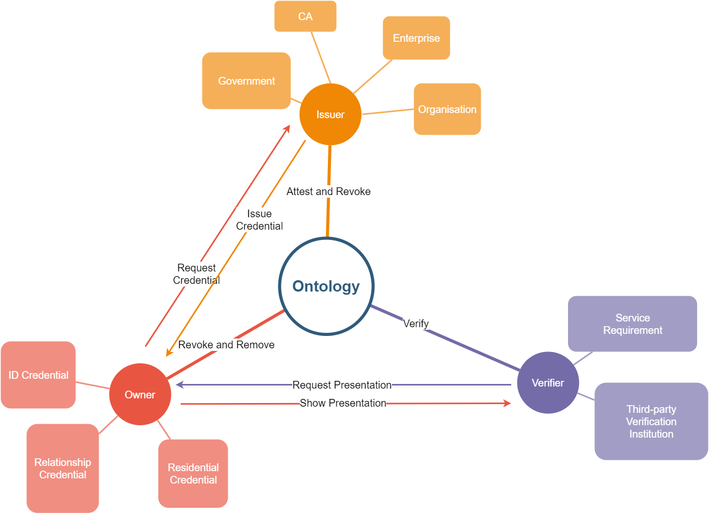

# How to Use Ontology Verifiable Credential 2.0?

As the illustration above, there are three roles in the Ontology Verifiable Credential 2.0 protocol: owner, issuer, verifier.

**Owner** holds some **verifiable credential** issued by the **issuer**. In the other hands, owner create some **verifiable presentation** by consolidating multi
**verifiable credential**. Owner spread these presentations at somewhere, and **verifier** would verify them to confirm they are valid or not.

## Verifiable Credential

A verifiable credential is some kind of proof, it issued by some credible issuer. Many verifiable credentials may owned by one.

Such as a credential prove that someone's name is "bob" and ID is "1234567...", and the other credential prove his residential address
is "XXXXXXXXX". So "bob" hold two verifiable credentials, the one is "ID credential", the other is "Resident credential".

## Verifiable Presentation

A verifiable presentation consists of one or more verifiable credentials, it unites these credentials to express some more
specific information.

In the example above, bob could unite "ID credential" and "Resident credential" to generate a verifiable presentation.
It means "bob live in XXXXXXXXX".

## Owner

Owner request issuer to issue a verifiable credential. So owner need to generate a verifiable request. Owner should
prepare a subject that contains specific information. Then, owner append his ontId to this request. In the finally,
owner use his ontId to sign this request and append signature to request. After the request constructed, owner send
it to issuer. While the issuer verify this request, issuer will use the subject in the request to create a verifiable
credential and return this credential to owner.

Owner repeats the above steps many times, so that owner own many verifiable credentials. Afterwards, owner could create
a presentation by unite many credentials. The presentation could show more information than single credential.

If owner want to revoke self verifiable credential in advance, instead of waiting for it to expire naturally, the owner
could revoke credential directly from ontology chain. The id of revoked verifiable credential existed in ontology until
owner remove it. Only owner could remove self credential, issuer could not remove any credential from ontology chain,
except the credential issued to issuer himself.

## Issuer

While the issuer receive the request from some owner, they would query all public keys that control the request ontId,
and verify request signature by using each of these public keys. If any public key verified, the request would be
considered a valid request, the owner would start the process that issue verifiable credential for this request.

Issuers generate credential, set the expiration date and issuance date, and set the credential subject and credential
status, that contains credential verification method. The most important is, issuer use their ontId to sign the credential.

Finally, issuer commit the id of this credential to ontology chain, so that this credential effected. The issuer should
use a smart contract to record each credential status at ontology chain. There is no require that all issuer should use
same smart contract to record credential status. Each issuer may use themselves record contract, or they share the same
contract. Issuer should set the contract address to credential so that verifier could use this item to verify credential
status.

The issuer has been regarded as authority. After issuer sign and commit the credential, the credential is authoritative,
and it could be used to prove some information.

As the owner could revoke credential, issuer also has this right. They could revoke the any verifiable credential that
issued by themselves.

## Verifier

Verifier could verify each verifiable credential. They check the authority of credential issuer, check the credential
expired or not, check issuer signature, and check credential existed in ontology chain or not.

For the verifiable presentation, verifier should check each credential contained at presentation. Verifier also should
check the proof of the presentation, that is generated by presentation holder.